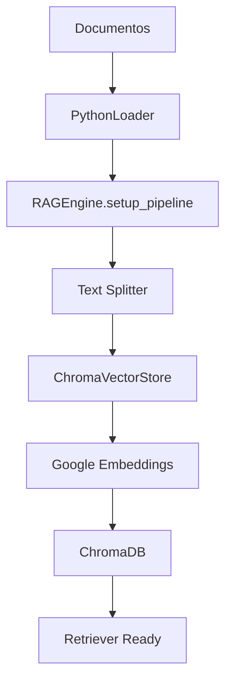
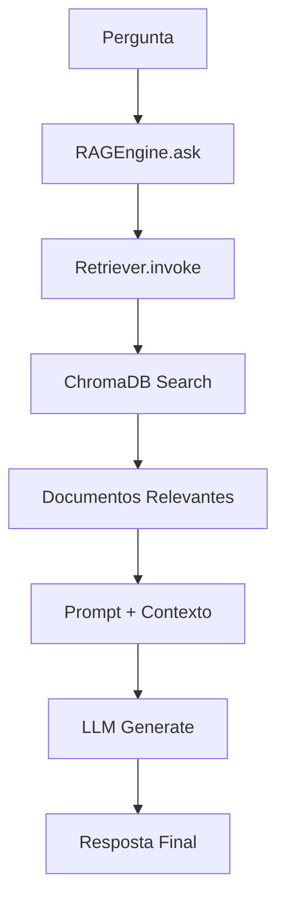

# Arquitetura do Sistema RAG

## Visão Geral

Este projeto implementa um sistema RAG (Retrieval-Augmented Generation) modular e extensível, construído com arquitetura orientada a componentes.

## Componentes Principais

### 1. **Loaders** (`src/loaders/`)
Responsáveis por carregar e processar documentos de diferentes fontes.

- **`BaseLoader`** - Interface abstrata para todos os loaders
- **`PythonLoader`** - Especializado em carregar arquivos `.py`
- **Factory Pattern** - `get_loader()` para criar instâncias

**Capacidades:**
- ✅ Carregamento de arquivos com padrões glob
- ✅ Metadados automatizados (tamanho, tipo, etc.)
- ✅ Encoding automático (UTF-8)
- ✅ Barra de progresso

### 2. **LLMs** (`src/llms/`)
Modelos de linguagem para geração de respostas contextualizadas.

- **`BaseLLM`** - Interface abstrata para LLMs
- **`GeminiLLM`** - Integração com Google Gemini (remoto)
- **`OllamaLLM`** - Integração com Ollama (local)
- **Factory Pattern** - `get_llm()` para criar instâncias

**Capacidades:**
- ✅ Múltiplos provedores (Google, Ollama)
- ✅ Configurações personalizáveis (temperatura, modelo)
- ✅ Prompts otimizados para RAG
- ✅ Troca dinâmica de modelos
- ✅ Sem limitações de quota (Ollama)

### 3. **Vector Stores** (`src/vector_stores/`)
Armazenamento vetorial para busca por similaridade.

- **`BaseVectorStore`** - Interface abstrata para vector stores
- **`ChromaVectorStore`** - Implementação com ChromaDB
- **Factory Pattern** - `get_vector_store()` para criar instâncias

**Capacidades:**
- ✅ Chunking automático de documentos
- ✅ Embeddings com Google Gemini
- ✅ Persistência em disco
- ✅ Múltiplos tipos de busca (similarity, MMR, threshold)
- ✅ Estatísticas detalhadas

### 4. **RAG Engine** (`src/core/engine.py`)
Orquestrador principal que coordena todos os componentes.

**Pipeline Completo:**
1. **Setup**: Carrega → Chunking → Indexação → Retriever
2. **Query**: Pergunta → Busca → Contexto → LLM → Resposta

**Capacidades:**
- ✅ Pipeline end-to-end
- ✅ Configurações flexíveis de retriever
- ✅ Métricas de performance
- ✅ Tratamento robusto de erros
- ✅ Gerenciamento de estado

## Arquitetura de Software

### Padrões Utilizados

1. **Factory Pattern**: Para criação de componentes
2. **Strategy Pattern**: Para diferentes tipos de busca
3. **Template Method**: Para pipeline de processamento
4. **Dependency Injection**: Para flexibilidade de componentes

### Estrutura de Diretórios

```
src/
├── core/
│   ├── __init__.py
│   └── engine.py          # RAGEngine - Orquestrador principal
├── loaders/
│   ├── __init__.py        # Factory functions
│   ├── base.py           # BaseLoader - Interface abstrata
│   └── py_loader.py      # PythonLoader - Implementação
├── llms/
│   ├── __init__.py        # Factory functions
│   ├── base.py           # BaseLLM - Interface abstrata
│   ├── gemini_llm.py     # GeminiLLM - Google Gemini
│   └── ollama_llm.py     # OllamaLLM - Ollama local
└── vector_stores/
    ├── __init__.py        # Factory functions
    ├── base.py           # BaseVectorStore - Interface
    └── chroma_store.py   # ChromaVectorStore - ChromaDB
```

## Fluxo de Dados

### Indexação


### Consulta


## Características Técnicas

### Escalabilidade
- Componentes independentes e substituíveis
- Factory pattern para fácil extensão
- Configurações externalizadas

### Performance
- Chunking otimizado para contexto
- Cache de embeddings
- Busca vetorial eficiente

### Robustez
- Tratamento de erros em cada camada
- Validação de dados de entrada
- Fallbacks para diferentes cenários

### Flexibilidade
- Múltiplos provedores de LLM
- Diferentes tipos de busca
- Configurações por componente

## Extensibilidade

Para adicionar novos componentes:

1. **Novo Loader**: Herde de `BaseLoader`, implemente `load()`
2. **Novo LLM**: Herde de `BaseLLM`, implemente `ask()`
3. **Novo Vector Store**: Herde de `BaseVectorStore`
4. **Registre na Factory**: Adicione ao respectivo `__init__.py`