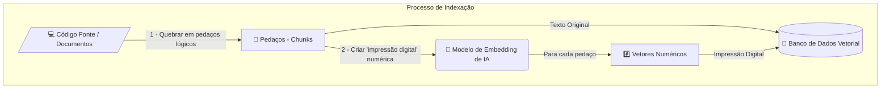
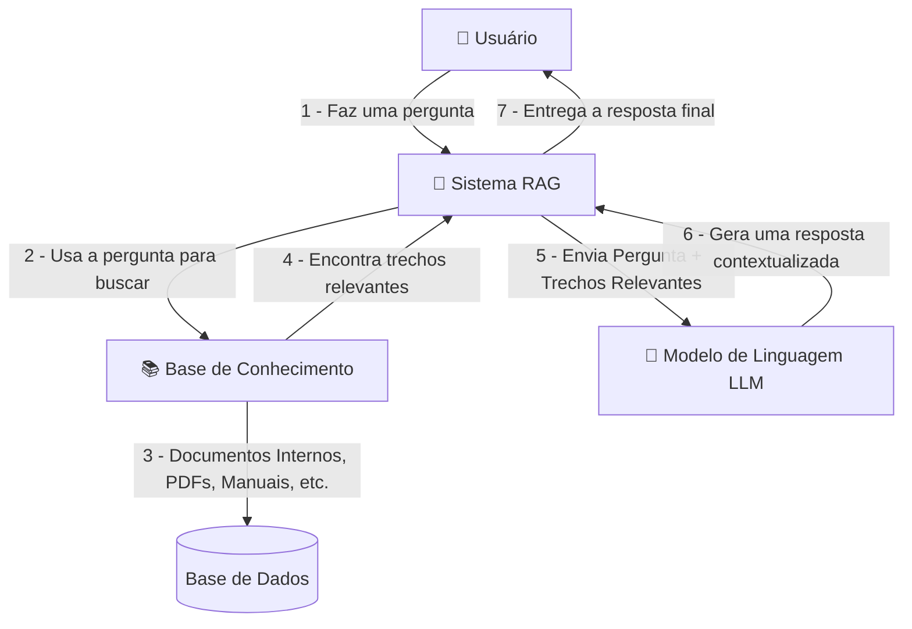

# RAG (Retrieval-Augmented Generation) - Conceitos

*Em português - Geração Aumentada por Recuperação*

## Em Resumo

O RAG é uma técnica que turbina a Inteligência Artificial, tornando-a mais confiável, precisa e útil para tarefas do dia a dia, desde responder a perguntas de clientes em um site até auxiliar profissionais em pesquisas complexas.

## Uma Analogia

RAG: Dando uma "cola" para a Inteligência Artificial

Imagine que você está fazendo uma prova muito difícil. Você estudou bastante, mas não se lembra de todos os detalhes. Agora, imagine que o professor permite que você consulte um livro específico, apenas com as informações relevantes para a prova, antes de responder cada pergunta. Suas respostas seriam muito mais precisas e completas, certo?

De forma simples, é exatamente isso que o RAG (Retrieval-Augmented Generation, ou Geração Aumentada por Recuperação) faz com a Inteligência Artificial. Em vez de depender apenas do que "estudou" (seu treinamento original), a IA pode consultar uma fonte de informações externa e atualizada antes de gerar uma resposta para você.

## O que o RAG resolve?

O RAG tem como proposta resolver alguns dos principais desafios dos grandes modelos de linguagem:

- **Evita "alucinações":** Reduz as chances de a IA inventar informações, pois ela baseia suas respostas em dados concretos.

- **Mantém a IA atualizada:** Permite que a IA tenha acesso a informações recentes, sem a necessidade de passar por um processo de treinamento completo e caro cada vez que novos dados surgem.

- **Aumenta a confiança:** Ao fornecer respostas baseadas em fontes específicas, os sistemas com RAG podem, inclusive, citar de onde tiraram a informação, permitindo que os usuários verifiquem a veracidade dos dados.

## Como funciona na prática?

Temos 2 grandes pontos a entender aqui: **Indexação** e **Conversação**.

### Indexação

Esse diagrama mostra o processo de preparação dos dados para que possam ser consultados depois.

1. **Código Fonte / Documentos:** É o ponto de partida. Representa toda a sua base de conhecimento bruta que você deseja que a IA consulte.

2. **Quebrar em Pedaços (Chunks):** Os documentos ou códigos são divididos em segmentos menores e lógicos. Isso é importante porque facilita para o modelo de IA entender o contexto de cada pedaço individualmente.

3. **Modelo de Embedding (IA):** Cada "chunk" de texto é então processado por um modelo de inteligência artificial específico (o Embedding Model). A função deste modelo é transformar o significado semântico do texto em vetor.

4. **Banco de Dados Vetorial:** Por fim, tanto os pedaços de texto originais quanto seus respectivos vetores são armazenados no banco de dados. Um banco que tenha a engine de busca com base em similaridade de vetores.

### Conversando com o agente com RAG

Do ponto de vista do usuário/consumidor, o processo do RAG pode ser dividido em duas etapas.

1. **Recuperação (Retrieval):** Quando você faz uma pergunta a um sistema com RAG, ele primeiro busca as informações mais relevantes para a sua questão em uma base de dados específica. Essa base pode ser qualquer coisa: documentos internos de uma empresa, artigos de notícias recentes, manuais de produtos, etc.

2. **Geração (Generation):** Com essa "cola" em mãos - ou seja, as informações recuperadas -, a Inteligência Artificial gera uma resposta muito mais completa, precisa e contextualizada para a sua pergunta. Ela combina o que encontrou na busca com seu conhecimento geral para formular a melhor resposta possível.

#### Fluxo Completo

1. **A Pergunta (Usuário -> Sistema RAG)** - Tudo começa com o prompt, como "Preciso de um crud de usuários com as propriedades name, email, password, lastLogin, createdAt, updatedAt, status (ativo | inativo)".

2. **A Busca (Sistema RAG -> Base de Conhecimento)** - Em vez de tentar adivinhar a resposta, o sistema RAG primeiro atua como um motor de busca. Ele vasculha a Base de Conhecimento (seus documentos ou códigos) para encontrar trechos exatos que falam sobre "crud".

3. **A "Cola" (Base de Conhecimento -> Sistema RAG)** - O sistema coleta os `chunks` que encontrar, como códigos com comentários explicando a implementação do crud juntamente com exemplos.

4. **O Contexto (Sistema RAG -> LLM)** - Com os chunks, o sistema agora envia para o LLM um prompt com sua mensagem juntamente à "cola" encontrada.

5. **A Resposta (LLM -> Sistema RAG)** - O LLM lê a pergunta e usa as informações da "cola" como referência.

6. **A Entrega (Sistema RAG -> Usuário)** - O sistema entrega a resposta final e bem fundamentada para o usuário.